<p align="center">
  <a href="https://revelith.com/">
    <picture>
      <source srcset="../assets/readme/hero-dark.webp" media="(prefers-color-scheme: dark)">
      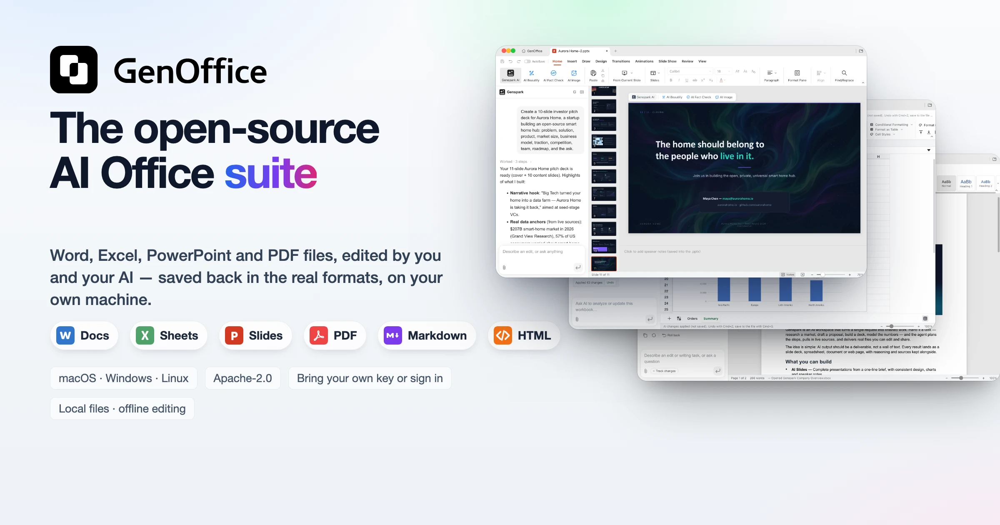
    </picture>
  </a>
</p>

<h1 align="center">ReveLith</h1>

<p align="center"><b>La primera suite ofimática de IA de código abierto completa del mundo.</b><br>
Archivos Word, Excel, PowerPoint y PDF, editados por ti y tu IA, guardados de nuevo en los formatos reales.</p>

<p align="center">
  <a href="../../LICENSE"></a>
  <a href="https://github.com/sainibhaowal/ReveLith/releases/latest"></a>
  <a href="https://github.com/sainibhaowal/ReveLith/releases"></a>
  <a href="https://github.com/sainibhaowal/ReveLith/stargazers"></a>
</p>

<p align="center"><a href="../../README.md">English</a> · <b>Español</b> · <a href="README.pt-BR.md">Português (Brasil)</a> · <a href="README.de.md">Deutsch</a> · <a href="README.fr.md">Français</a> · <a href="README.zh-CN.md">简体中文</a> · <a href="README.zh-TW.md">繁體中文</a> · <a href="README.ko.md">한국어</a> · <a href="README.ja.md">日本語</a> · <a href="README.ar.md">العربية</a> · <a href="README.ru.md">Русский</a> · <a href="README.it.md">Italiano</a> · <a href="README.nl.md">Nederlands</a> · <a href="README.pl.md">Polski</a> · <a href="README.cs.md">Čeština</a> · <a href="README.id.md">Bahasa Indonesia</a> · <a href="README.ms.md">Bahasa Melayu</a> · <a href="README.th.md">ไทย</a> · <a href="README.hi.md">हिन्दी</a> · <a href="README.he.md">עברית</a></p>

<p align="center">
  <a href="#download"><b>Descargar</b></a> ·
  <a href="#command-line-and-agent-skill"><b>CLI</b></a> ·
  <a href="#mcp-server"><b>MCP</b></a> ·
  <a href="https://revelith.com/"><b>Sitio web</b></a> ·
  <a href="https://revelith.com/join"><b>Comunidad</b></a> ·
  <a href="../../PRIVACY.md"><b>Privacidad</b></a>
</p>

ReveLith es una alternativa gratuita y de código abierto a Microsoft Office
para macOS, Windows y Linux. Abre y guarda archivos nativos `.docx`, `.xlsx`
y `.pptx`, edita PDF, Markdown y HTML, y coloca un agente de IA junto a cada
documento: no un chat pegado a un lado, sino un editor que lee el archivo,
hace el cambio y te muestra exactamente qué tocó.

- **Formatos reales, con preservación de bytes.** Solo se reescribe lo que
  editas. Todo lo demás en el archivo se conserva byte por byte, así que los
  documentos siguen funcionando en Word, Excel y PowerPoint.
- **IA que puedes revisar.** Los cambios llegan como cambios con seguimiento
  y diffs con reversión de un clic. Las hojas de cálculo obtienen fórmulas en
  vivo, no números pegados. Las presentaciones y páginas se generan en el
  lienzo y siguen siendo totalmente editables.
- **Local por diseño.** Los archivos se abren, editan, guardan y convierten
  en tu equipo. PDF → Word / Excel / PowerPoint, Markdown → Word y HTML →
  Word se ejecutan todos en el dispositivo. Solo las llamadas de IA salen de
  tu equipo, hacia el proveedor que elijas.
- **Tus claves o ninguna.** Inicia sesión con ReveLith y olvídate de las
  claves, o usa tu propia clave para Claude, OpenAI, Gemini, DeepSeek, Kimi,
  GLM, Qwen, Doubao, MiniMax, Grok, Mistral, OpenRouter, Requesty, o cualquier endpoint
  compatible con OpenAI, servidores locales incluidos.
- **Automatizable y listo para agentes.** La app incluye una línea de comandos
  `revelith` y un skill para Claude Code, Codex, Cursor, Gemini CLI, GitHub
  Copilot, OpenCode y Windsurf, de modo que un agente de programación puede
  crear, convertir, leer y editar archivos Office reales en tu equipo sin
  abrir una ventana.

**Consíguelo:** [macOS](https://github.com/sainibhaowal/ReveLith/releases/latest) (Apple Silicon e Intel) ·
[Windows](https://github.com/sainibhaowal/ReveLith/releases/latest) (x64 y Arm) ·
[Linux](https://github.com/sainibhaowal/ReveLith/releases/latest) (deb, rpm, AppImage) —
detalles y requisitos en [Download](#download).

## Demo

Seis apps, un solo panel de IA y una línea de comandos para tu agente de
programación. Cada captura es la app real en macOS, con la IA impulsada por
el prompt que puedes leer en el panel.

### 1 · Docs — abre y edita `.docx` con una IA que puedes revisar

<table>
<tr>
<td width="50%">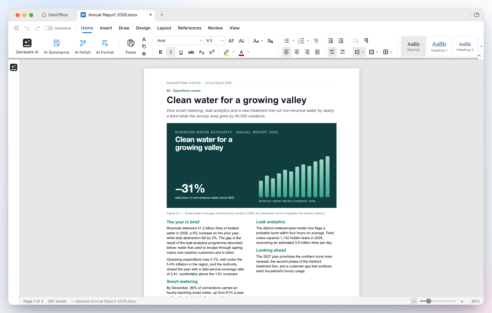</td>
<td width="50%">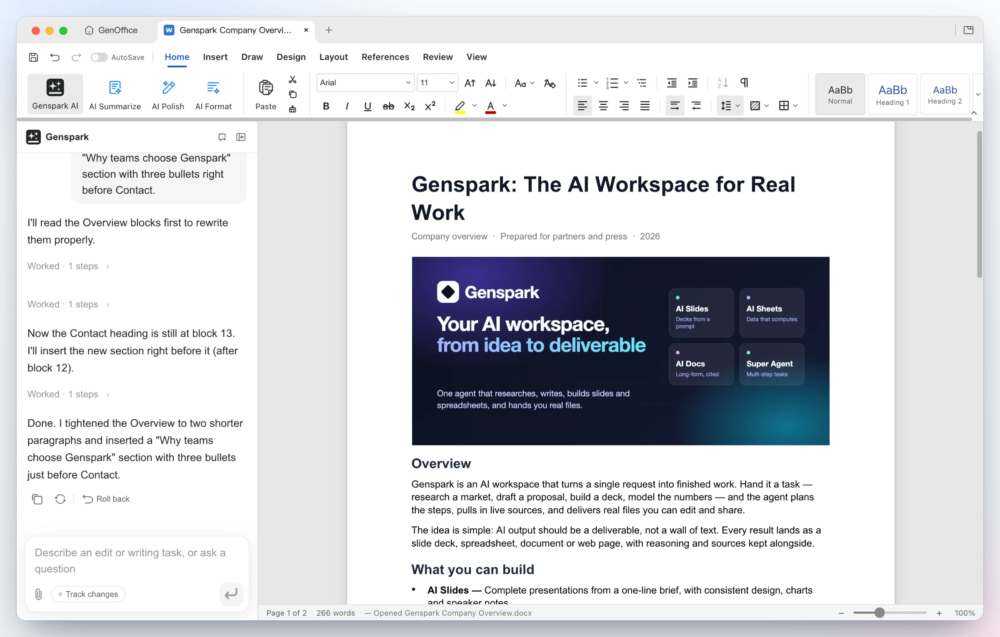</td>
</tr>
<tr>
<td><b>Abre el archivo tal como lo compone Word</b> — secciones a dos columnas, imágenes a sangre completa, tablas con sombreado, encabezados y pies de página, con la paginación calculada según las métricas de línea de Word. Los estilos, comentarios, cambios con seguimiento, ecuaciones y trazos de tinta se conservan intactos en el ida y vuelta.</td>
<td><b>Pide el cambio</b> — la IA lee los bloques que necesita, reescribe la sección Overview e inserta una nueva sección con viñetas. Cada turno de la IA es una instantánea que puedes revertir; con <b>Track changes</b> activado, los cambios llegan como revisiones al estilo Word.</td>
</tr>
</table>

### 2 · Sheets — `.xlsx` con fórmulas y gráficos en vivo, no números pegados

<table>
<tr>
<td width="50%">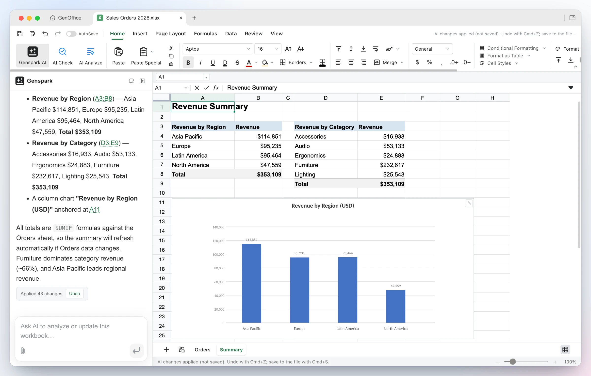</td>
<td width="50%">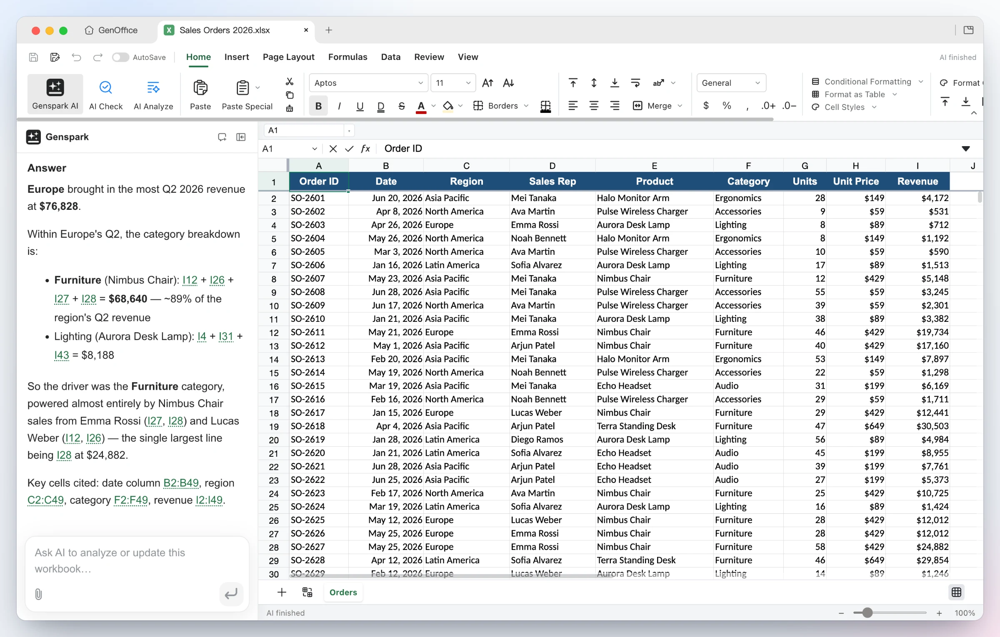</td>
</tr>
<tr>
<td><b>Créala</b> — a partir de una sola frase, el agente añade una hoja Summary con auténticas fórmulas <code>SUMIF</code> por región y categoría, inserta un gráfico de columnas y aplica los 43 cambios como un único lote que se puede deshacer.</td>
<td><b>Pregúntale</b> — las preguntas sobre el libro se responden con el razonamiento y las celdas exactas usadas, presentadas como citas en las que se puede hacer clic. Por debajo: un motor <code>.xlsx</code> en Rust desarrollado internamente, tablas dinámicas, segmentaciones de datos, formato condicional y trazado de fórmulas.</td>
</tr>
</table>

### 3 · Slides — de un prompt a una presentación `.pptx`

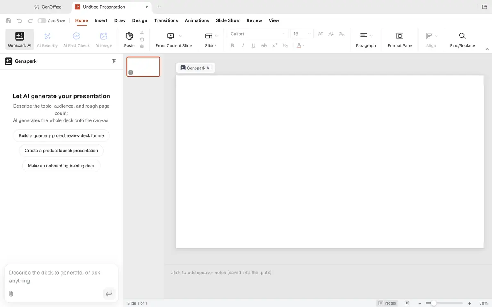

<table>
<tr>
<td width="50%">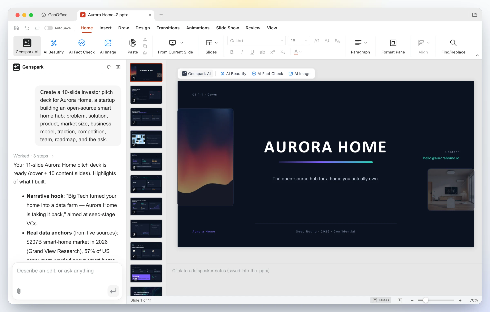</td>
<td width="50%">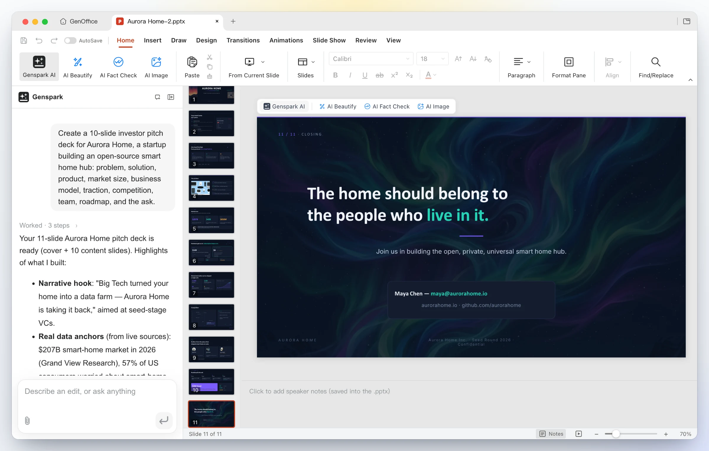</td>
</tr>
<tr>
<td><b>Con una sola línea</b> — «Crea una presentación de 10 diapositivas para inversores de Aurora Home…». ReveLith planifica el hilo narrativo, investiga las cifras y redacta cada diapositiva en el lienzo como un auténtico <code>.pptx</code>.</td>
<td><b>Una presentación terminada</b> — once diapositivas diseñadas con tipografía e imágenes consistentes y una llamada a la acción de cierre; sigue editando con patrones, diseños, guías inteligentes y recorte no destructivo, o pide al panel que reestilice, reescriba y reordene.</td>
</tr>
</table>

### 4 · PDF — edita texto de PDF directamente, convierte PDF a Word en el dispositivo

<table>
<tr>
<td width="50%">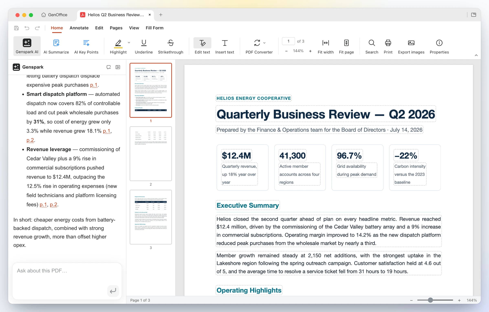</td>
<td width="50%">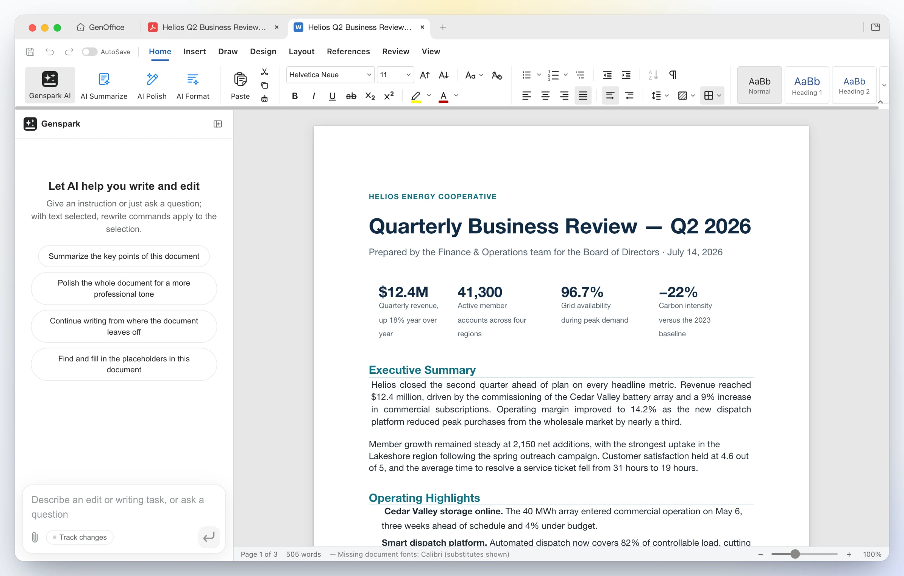</td>
</tr>
<tr>
<td><b>Edita dentro de la página</b> — el modo Edit text resalta el contorno de cada bloque de texto para volver a escribirlo directamente; el flujo de contenido se reescribe mediante PDFium con las fuentes originales, sin recurrir a una anotación que tapa el texto. Pregunta a la IA sobre un informe extenso y obtén respuestas con citas de página.</td>
<td><b>Convierte en el dispositivo</b> — <b>PDF Converter → PDF to Word</b> produce un <code>.docx</code> editable que se abre en Docs junto al original, con los encabezados, filas de estadísticas y párrafos intactos. Los destinos Excel y PowerPoint funcionan igual; las páginas escaneadas pasan por el OCR del sistema.</td>
</tr>
</table>

### 5 · HTML — un generador de páginas e interfaces con IA, primero el brief de diseño

Indica para qué es la página y para quién es. La IA propone primero un
**brief de diseño** — el gancho, la paleta, la tipografía y las direcciones
de estilo — y luego construye un único archivo `.html` autocontenido
siguiendo esos tokens.

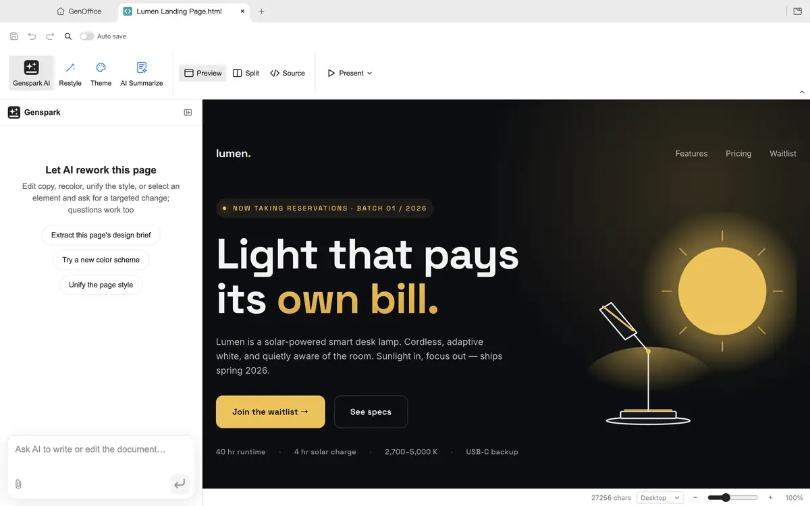

<table>
<tr>
<td width="50%">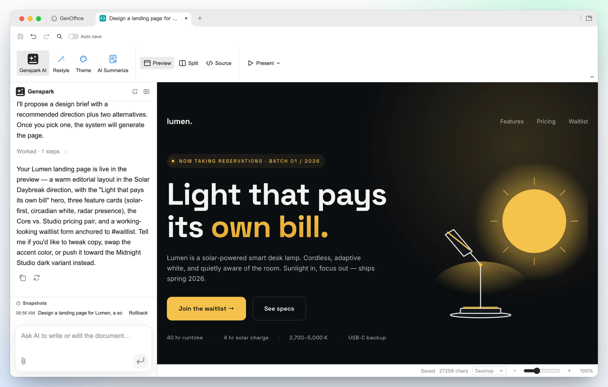</td>
<td width="50%">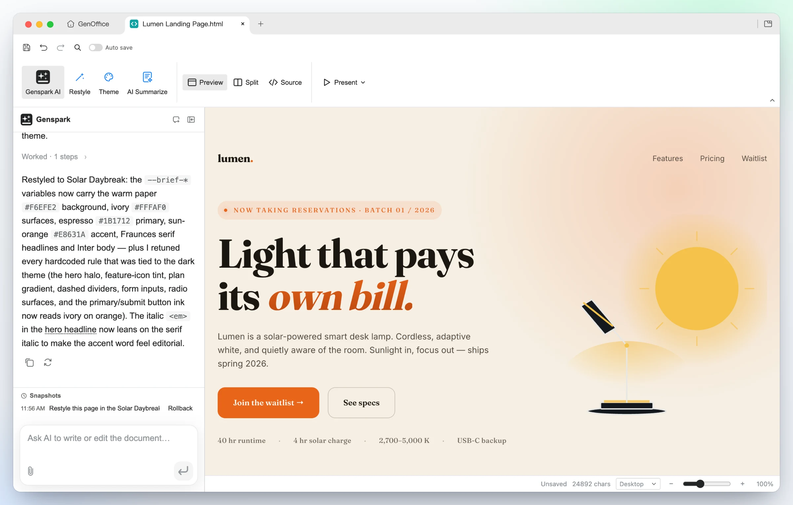</td>
</tr>
<tr>
<td><b>Generada a partir de un prompt</b> — un hero llamativo, tarjetas de funciones, precios y un formulario de lista de espera para Lumen, construido en la dirección Midnight Studio. Haz clic en cualquier elemento para reestilizarlo, doble clic para editar el texto, o cambia a la vista de código de CodeMirror.</td>
<td><b>El mismo diseño, otra dirección</b> — una sola solicitud de <b>Restyle</b> cambia los tokens del brief y la página se adapta: papel cálido, serif editorial, acento naranja sol, sin reescribir nada. Preséntala en pantalla completa, o expórtala como PDF o como un documento de Word nativo y editable.</td>
</tr>
</table>
<table>
<tr>
<td width="50%">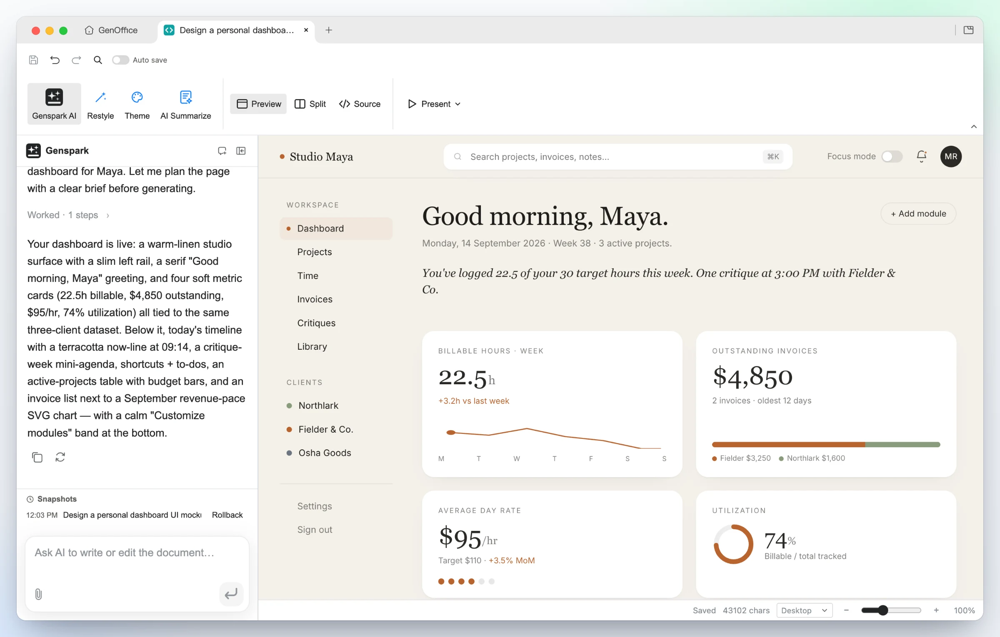</td>
<td width="50%">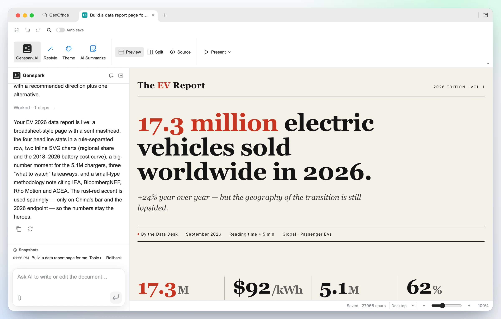</td>
</tr>
<tr>
<td><b>Maquetas de interfaz</b> — la plantilla inicial «personal dashboard» convierte una persona en un diseño funcional: barra lateral izquierda, saludo, minigráfico de horas facturables, tarjetas de facturas y utilización, todo en HTML real que puedes entregar a un desarrollador.</td>
<td><b>Historias de datos</b> — la plantilla inicial «data report» construye un periódico editorial: cabecera serif, una cifra destacada, una fila de estadísticas separada por una línea, gráficos SVG en línea y una nota metodológica.</td>
</tr>
</table>

### 6 · Markdown — un editor de bloques sobre `.md` plano, con Ask AI

<table>
<tr>
<td width="50%">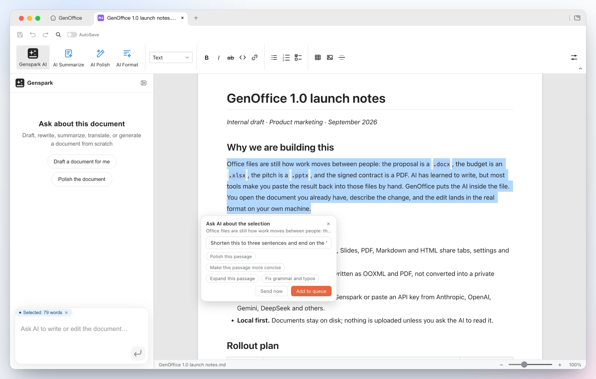</td>
<td width="50%">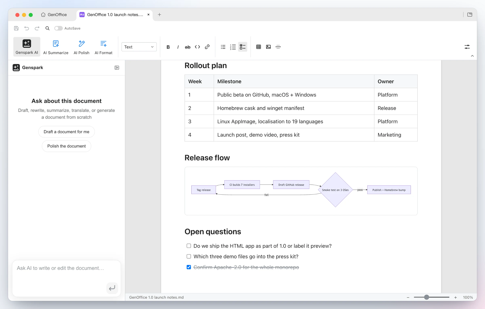</td>
</tr>
<tr>
<td><b>Ask AI sobre una selección</b> — selecciona cualquier pasaje y aparece un chip de <b>Ask AI</b>: escribe una instrucción o elige una sugerencia, envíala al momento, o encola varias ediciones ancladas y ejecútalas de una sola vez. El mismo punto de entrada existe en todas las apps.</td>
<td><b>Se renderiza, se guarda como Markdown plano</b> — encabezados, listas, tablas, imágenes, bloques de código y diagramas de Mermaid en un editor de bloques Tiptap, que se escriben de nuevo como <code>.md</code> plano, con una exportación <b>Markdown → Word</b> totalmente local.</td>
</tr>
</table>

### 7 · CLI — tu agente de programación maneja ReveLith, en tu equipo

ReveLith incluye una línea de comandos `revelith` y un skill de agente.
Instala el skill y Claude Code, Codex, Cursor, Gemini CLI, GitHub Copilot,
OpenCode o Windsurf podrán crear, convertir, leer y editar archivos Office
reales con los mismos motores que las apps, sin abrir una ventana.

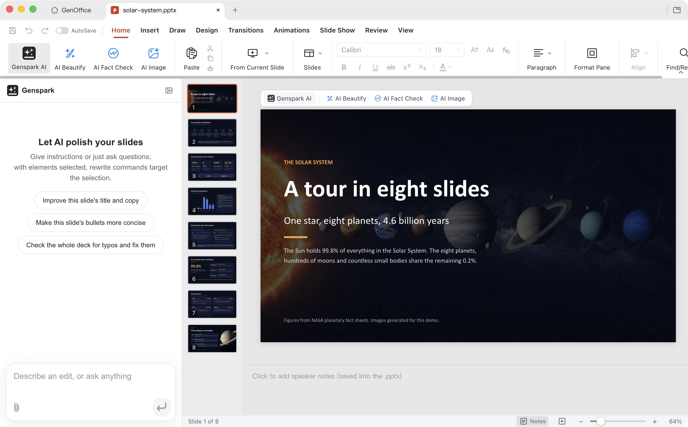

<table>
<tr>
<td width="50%">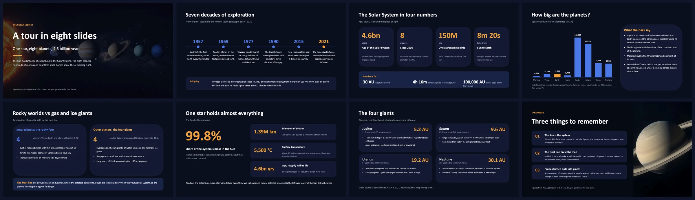</td>
<td width="50%">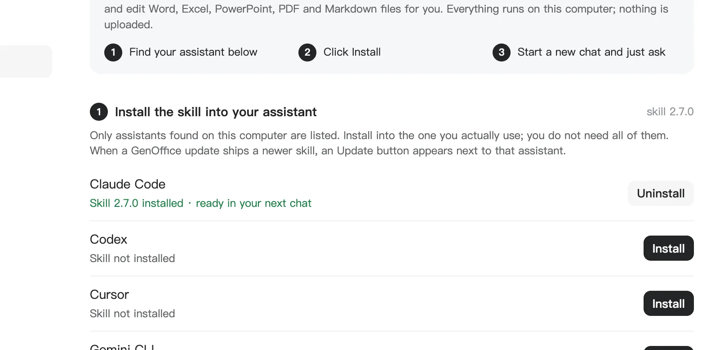</td>
</tr>
<tr>
<td><b>Un solo prompt a tu agente</b> — «Crea una presentación de ocho diapositivas sobre el Sistema Solar». El agente lee el skill, escribe una hoja de estilos, un esquema y una especificación de página por diapositiva, genera las dos fotos con <code>revelith image</code> y deja que <code>revelith slides check</code> rechace todo lo que desborde o se superponga antes de que <code>revelith create</code> ensamble el <code>.pptx</code> y <code>slides render</code> devuelva un PNG por diapositiva para revisarlo.</td>
<td><b>Instálalo una vez, desde Ajustes → Integraciones</b> — ReveLith muestra los agentes de programación que encuentra en este equipo y escribe el skill en cada uno de los que elijas. O descarga el skill como zip, o ejecuta <code>npx skills add revelith-ai/revelith</code>. Los comandos y el flujo de trabajo completo están en <a href="#command-line-and-agent-skill">Línea de comandos y skill de agente</a>.</td>
</tr>
</table>

### 8 · MCP — las mismas herramientas a través del Model Context Protocol

Cada comando de `revelith` es también una herramienta MCP. Claude Code,
Claude Desktop, Cursor y cualquier otro cliente MCP pueden iniciar
`revelith mcp` por sí mismos, sin necesidad de instalar ningún skill ni
abrir una ventana, y obtienen 29 herramientas más las referencias de
operaciones como recursos. Un segundo servidor HTTP dentro de la app permite
que un agente construya un documento Word en una pestaña de editor visible
mientras lo observas.

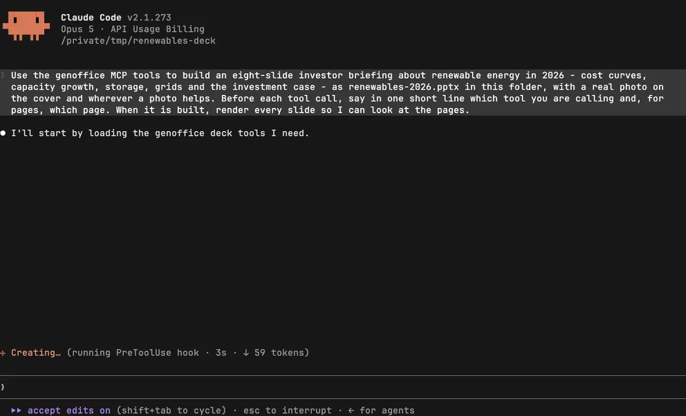

<table>
<tr>
<td width="50%">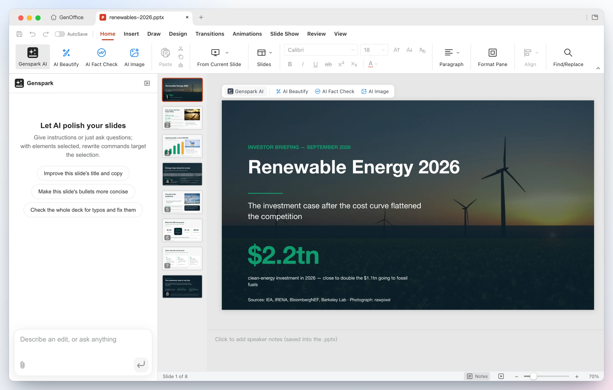</td>
<td width="50%">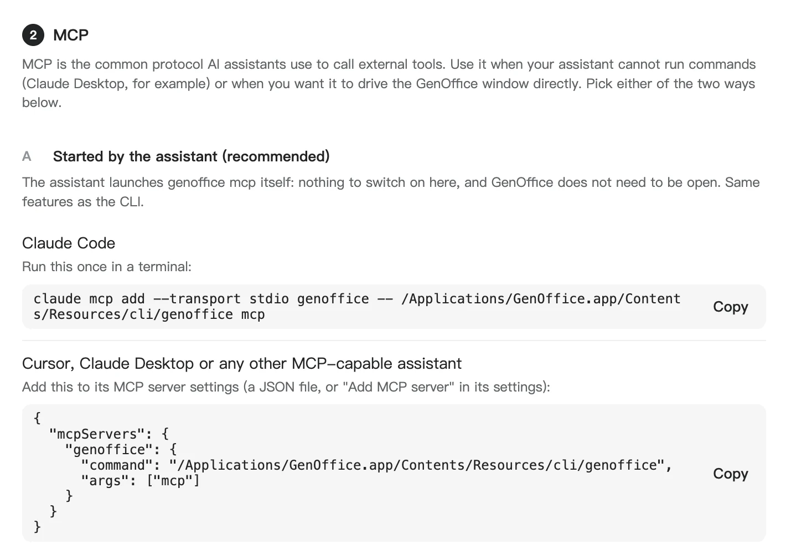</td>
</tr>
<tr>
<td><b>Un prompt, 38 llamadas a herramientas, sin terminal</b> — «Crea una presentación de inversión de ocho diapositivas sobre energías renovables en 2026, con una foto real en la portada y dondequiera que una foto ayude». El agente obtiene las figuras y las fotos con <code>search</code>, pregunta a <code>media</code> si cada imagen candidata es una fotografía real, llama a <code>deck_start</code> con una hoja de estilos y un esquema, después <code>deck_page</code> una vez por diapositiva; cada página se comprueba contra el esquema y la paleta antes de conservarla, <code>deck_build</code> ensambla el <code>.pptx</code>, <code>slides_audit</code> busca desbordes, <code>slides_render</code> devuelve un PNG por diapositiva como contenido de imagen que el modelo puede mirar, y <code>deck_replace</code> corrige las tres páginas que no le convencieron.</td>
<td><b>Conéctate una vez, desde Ajustes → Integraciones</b> — copia la línea <code>claude mcp add</code> para Claude Code, o el bloque JSON en Cursor, Claude Desktop o cualquier otro cliente MCP. La opción B activa el servidor HTTP local para el editor de Word visible. Ambas se describen en <a href="#mcp-server">Servidor MCP</a>.</td>
</tr>
</table>

## Por qué ReveLith

- **Código abierto**, Apache-2.0, desarrollado abiertamente en GitHub.
- **Se ejecuta en tu equipo.** Apps nativas para macOS, Windows y Linux; los
  archivos se quedan en tu disco y cada edición, guardado y conversión ocurre
  en tu máquina.
- **Archivos Office reales.** `.docx`, `.xlsx` y `.pptx` nativos, con
  preservación de bytes: las partes del archivo que no tocas se copian
  exactamente igual.
- **Una IA que edita el propio documento.** Cambios con seguimiento en Docs,
  fórmulas y gráficos en vivo en Sheets, diapositivas dibujadas directamente
  en el lienzo, y cada turno de la IA deja una instantánea a la que puedes
  volver.
- **Tu modelo, tu clave.** Inicia sesión con ReveLith, o usa tu propia clave
  para Claude, OpenAI, Gemini, DeepSeek y más; también incluye servidores
  locales y cualquier endpoint compatible con OpenAI.
- **PDF hecho como debe ser.** Edita el texto directamente en la página y
  convierte PDF a Word, Excel o PowerPoint en el dispositivo, con OCR del
  sistema para escaneos.
- **También Markdown y HTML**, con el mismo panel de IA y exportación local a
  Word.
- **Automatizable.** Una línea de comandos `revelith`, un skill de agente y
  un servidor MCP ponen todos los motores al servicio de Claude Code, Claude
  Desktop, Codex, Cursor y otros agentes, siempre en el dispositivo.
- **Gratis**, tanto para personas individuales como para equipos.

## Backends de IA

**Inicia sesión con ReveLith** y no hay nada que configurar: las llamadas al
modelo se enrutan a través del proxy de ReveLith (familias Claude, GPT y
Gemini) y los agentes obtienen búsqueda web y de imágenes, generación de
imágenes, y análisis de imagen/audio/video.

**O usa tu propia clave.** Settings → AI incluye Claude, OpenAI, Gemini,
DeepSeek, Kimi, GLM, Qwen, Doubao, MiniMax, Grok, Mistral, OpenRouter, Requesty y
OpenCode Zen/Go, además de una ranura personalizada para cualquier endpoint
compatible con OpenAI (URL base + clave), incluidos servidores de modelos
locales. La búsqueda y los medios tienen sus propios proveedores por
capacidad en **AI Media & Search**: Serper o Tavily para búsqueda web, y
OpenAI, Gemini, Doubao/Seedream, GLM, Grok, Qwen, MiniMax o cualquier
endpoint de imágenes compatible con OpenAI para generación de imágenes y
análisis de imagen/video.

Toda la suite incluye temas claro, oscuro y del sistema. Los temas solo
cambian lo que se ve en pantalla: las exportaciones, las impresiones y los
archivos guardados siempre conservan los colores propios del documento.

<a id="command-line-and-agent-skill"></a>

## Línea de comandos y skill de agente

Todo lo que las apps pueden hacer con un archivo, la línea de comandos
`revelith` puede hacerlo desde una terminal: inspeccionar, convertir, crear,
leer y editar Word, Excel, PowerPoint, PDF, Markdown y HTML con los mismos
motores, sin interfaz gráfica. Se instala con ReveLith, no necesita ningún
runtime propio y nunca envía un documento a ninguna parte. Junto con el
**skill de agente** incluido, convierte a un agente de programación en un
trabajador documental que produce archivos Office reales en lugar de
aproximaciones en Markdown.

**Funciona con:** Claude Code, Codex, Cursor, Gemini CLI, GitHub Copilot,
OpenCode y Windsurf de forma nativa, con cualquier otro agente que lea
skills, y, a través del [servidor MCP](#mcp-server), Claude Desktop y
cualquier cliente MCP.

### Instalar el skill

| Cómo                                      | Qué ocurre                                                                                                                                                                                              |
| ----------------------------------------- | ------------------------------------------------------------------------------------------------------------------------------------------------------------------------------------------------------- |
| **Ajustes → Integraciones** en la app     | Muestra los agentes encontrados en este equipo; con un clic escribe el skill en cada uno de los que elijas. Aparece un botón **Actualizar** cuando una versión de ReveLith trae un skill más reciente. |
| **Descargar como zip** en la misma página | El formato que claude.ai, las apps de escritorio de Claude y otros asistentes aceptan como skill subido.                                                                                                |
| `npx skills add revelith-ai/revelith`    | Lo instala desde este repositorio en cualquier agente compatible con skills.                                                                                                                            |

Después abre un chat nuevo y pide un documento. El skill enseña al agente
cuándo recurrir a `revelith`, cómo leer un archivo antes de editarlo y cómo
comprobar su propio trabajo.

### Inicio rápido desde la terminal

```bash
revelith --version
revelith info report.docx --json                  # headings and blocks; or sheets, slides, pages
revelith convert report.md --to pdf               # md/html/docx/xlsx/pptx → pdf, pdf → docx/xlsx/pptx, …
revelith create --type docx --from notes.md --out notes.docx
revelith create --type xlsx --from table.json --out sales.xlsx   # "=SUM(B2:B9)" cells stay live formulas
revelith docs read report.docx --range 0-9 --json # then `docs apply --ops edits.json` edits in place
revelith render report.docx --out shots/          # one PNG per page, to look at what you made
revelith open sales.xlsx                          # hand the result to the editor
```

Cada comando imprime un resumen de una línea, o un único objeto JSON con
`--json`. Las ediciones son atómicas: una operación rechazada deja el archivo
intacto y devuelve un error con indicaciones. `revelith help` muestra la
lista actual de comandos; la referencia completa está en
[packages/cli/README.md](../../packages/cli/README.md).

### Lo que el agente ejecuta realmente

La presentación del Sistema Solar de la demo de arriba llevó un solo prompt
en Claude Code. Por detrás, el agente siguió el flujo de trabajo por etapas
del skill y la CLI comprobó cada etapa antes de iniciar la siguiente:

```bash
revelith capabilities --json                        # which cloud tools ReveLith has configured
revelith guide slides design                        # the deck workflow and layout library
revelith image "the eight planets in a row …" --aspect 16:9 --out deck/assets/cover.jpg
revelith slides check deck/outline.json --json      # 8 pages, no findings
revelith slides check deck/pages/01.json --json     # builds one slide, audits overflow and overlap
…                                                    # one page file per slide, fixed until each check is clean
revelith create --type pptx --spec deck/pages --outline deck/outline.json --out deck/solar-system.pptx --json
revelith slides render deck/solar-system.pptx --out deck/shots --json
revelith slides audit deck/solar-system.pptx --json    # 8 slides, no layout issues
revelith slides replace deck/solar-system.pptx --slide 4 --spec deck/pages/05.json --json
revelith open deck/solar-system.pptx
```

Dentro de `revelith` no se hace ninguna llamada a un modelo: el agente
piensa, la CLI construye y comprueba, y el resultado se abre en ReveLith o
en PowerPoint como un `.pptx` normal.

<a id="mcp-server"></a>

### Servidor MCP

Los mismos comandos están disponibles como herramientas de
[Model Context Protocol](https://modelcontextprotocol.io) para asistentes
que no pueden ejecutar una terminal o a los que prefieras no dársela. Hay
dos formas de conectarse, ambas con fragmentos listos para copiar en
**Ajustes → Integraciones → MCP**:

| Vía                                   | Qué es                                                                                                                                                                                                                                                                                                                                                                                                                                                                                                                                                         |
| ------------------------------------- | -------------------------------------------------------------------------------------------------------------------------------------------------------------------------------------------------------------------------------------------------------------------------------------------------------------------------------------------------------------------------------------------------------------------------------------------------------------------------------------------------------------------------------------------------------------- |
| **A · `revelith mcp`** (recomendado) | Un servidor stdio que el propio asistente inicia; ReveLith no necesita estar abierto. Una herramienta por comando (`info`, `convert`, `create_docx`, `create_xlsx`, `create_pptx`, `create_pdf`, `docs_read` / `docs_apply` / `docs_check`, `sheet_*`, `slides_*`, `render`, `guide`, `search`, `image`, `media`, `open`) más el flujo de presentación por etapas `deck_start` → `deck_page` → `deck_build` → `deck_replace`. Las operaciones, especificaciones y el Markdown se pasan en línea, así que un cliente sin sistema de archivos también funciona. |
| **B · Servidor HTTP local**           | Se ejecuta dentro de la app ReveLith en `http://127.0.0.1:3093/mcp` (Streamable HTTP, con SSE heredado). Sus herramientas manejan una pestaña de editor de Word visible: `create_session`, `insert_content`, `replace_blocks`, `apply_ops`, `read_document`, `save_session`, y ves cómo el documento va tomando forma. Desactivado por defecto; actívalo en el mismo panel de ajustes.                                                                                                                                                                        |

```bash
# Claude Code
claude mcp add --transport stdio revelith -- revelith mcp
```

```jsonc
// Cursor, Claude Desktop o cualquier otro cliente MCP
{ "mcpServers": { "revelith": { "command": "revelith", "args": ["mcp"] } } }
```

Aquí `revelith` es la CLI incluida dentro de la app (en macOS
`/Applications/ReveLith.app/Contents/Resources/cli/revelith`; el panel de
ajustes imprime la ruta exacta de tu instalación). El servidor lleva sus
propias instrucciones de flujo de trabajo y expone las referencias de
operaciones como recursos `revelith://guide/*`, así que no hace falta
ningún skill; el skill y el servidor MCP pueden coexistir y el asistente
elige uno. Las funciones en la nube (`search`, `image`, `media`) siguen
pasando por el proveedor configurado en ReveLith; todo lo demás se ejecuta
localmente, y `REVELITH_ALLOWED_ROOTS` limita cada herramienta a las
carpetas que indiques.

La presentación sobre energías renovables de la demo de arriba es lo que
parece, desde el lado del protocolo, un solo prompt en Claude Code con solo
el servidor MCP de `revelith` conectado:

```text
capabilities · guide(slides, spec) · guide(slides, design)
search(query) ×4                         → IEA, BNEF and IRENA figures for the slides
search(query, images) ×7 · media(url, ask) ×7
                                         → candidate photos, each one checked to be a real photograph
deck_start(dir, style, outline)          → outline checked: 8 pages to write
deck_page(dir, 0, page) … deck_page(dir, 7, page)
                                         → each page checked against the outline and the palette; one page sent again
deck_build(dir, out)                     → renewables-2026.pptx, no image failures
slides_audit(file) · slides_render(file, out)
                                         → no layout findings; 8 PNGs come back as image content
deck_replace(dir, n, page) ×3 · slides_render(file, out)
                                         → three pages fixed after looking at the renders
```

Treinta y ocho llamadas, unos trece minutos, y el asistente nunca tocó una
terminal: las figuras, las fotos, las guías, las comprobaciones y las
renderizaciones viajaron todas como resultados de herramientas MCP. Solo
`search` y `media` salieron de la máquina, hacia el proveedor configurado
en ReveLith.

<a id="download"></a>

## Descargar

| Plataforma                              | Requisitos                                            | Descarga                                                                                         |
| --------------------------------------- | ----------------------------------------------------- | ------------------------------------------------------------------------------------------------ |
| **macOS** — Apple Silicon (arm64)       | macOS 11+                                             | [Última versión `.dmg` (arm64)](https://github.com/sainibhaowal/ReveLith/releases/latest)        |
| **macOS** — Intel (x64)                 | macOS 11+                                             | [Última versión `.dmg` (x64)](https://github.com/sainibhaowal/ReveLith/releases/latest)          |
| **Windows** (x64, la mayoría de los PC) | Windows 10+, Intel/AMD                                | [Instalador `-x64.exe` más reciente](https://github.com/sainibhaowal/ReveLith/releases/latest)   |
| **Windows** en Arm (ARM64)              | Windows 11 en Arm (Snapdragon X y similares)          | [Instalador `-arm64.exe` más reciente](https://github.com/sainibhaowal/ReveLith/releases/latest) |
| **Linux** — Debian / Ubuntu             | x86_64, glibc 2.34+ (Ubuntu 22.04 o posterior)        | [Última versión `.deb`](https://github.com/sainibhaowal/ReveLith/releases/latest)                |
| **Linux** — Fedora / RHEL / openSUSE    | x86_64, glibc 2.34+ (Fedora 35+, RHEL 9+, Leap 15.6+) | [Última versión `.rpm`](https://github.com/sainibhaowal/ReveLith/releases/latest)                |
| **Linux** — otras distribuciones        | x86_64, glibc 2.34+, FUSE 2                           | [Última versión `.AppImage`](https://github.com/sainibhaowal/ReveLith/releases/latest)           |

Todas las compilaciones provienen de `main`; los instaladores de macOS y
Windows están firmados. Las versiones anteriores están en la página de
[Releases](https://github.com/sainibhaowal/ReveLith/releases).

<details>
<summary><b>Instalación en Linux</b></summary>

El paquete deb se instala con apt: descarga las dependencias y añade
ReveLith al menú de aplicaciones:

```bash
sudo apt install ./revelith_<version>_amd64.deb
```

En Fedora, la familia RHEL u openSUSE, instala el rpm en su lugar:

```bash
sudo dnf install ./revelith-<version>.x86_64.rpm     # Fedora / RHEL family
sudo zypper install ./revelith-<version>.x86_64.rpm  # openSUSE
```

El AppImage se ejecuta directamente: instala el runtime de FUSE 2
(`sudo apt install libfuse2`; en Ubuntu 24.04 el paquete es `libfuse2t64`),
haz que el archivo sea ejecutable y luego ejecútalo:

```bash
chmod +x ReveLith-<version>.AppImage
./ReveLith-<version>.AppImage
```

</details>

## Cómo funciona

Siete apps de Electron — Docs, Sheets, Slides, PDF, Markdown, HTML y el
shell con pestañas — comparten una única capa de motor formada por paquetes
puros de TypeScript, más un sidecar en Rust para `.xlsx`. El archivo original
siempre es la fuente de verdad: los cambios se aplican como parches
acotados, y todo lo que el editor no tocó sobrevive intacto el ida y vuelta.

```
open docx ─► archive original by hash (never touched)
          ─► parse word/document.xml into a block tree, each block anchored to its original XML
          ─► Tiptap editor (manual + AI editing, dirty tracking)
save      ─► dirty blocks → OOXML fragments (referencing existing styles only)
          ─► splice into the original document.xml; untouched blocks keep their bytes
          ─► repack the zip; every other entry is copied byte-for-byte
```

El recorrido paquete por paquete (motores docx/pptx, `pdf2docx`,
`html2docx`, el núcleo del agente y los proveedores) está en
[CONTRIBUTING.md](../../CONTRIBUTING.md#engine-packages).

## Desarrollo

```bash
npm install
npm run fixtures     # generate test .docx fixtures
npm test             # engine + app unit tests (docs/sheets/slides need no display)
npm run typecheck    # tsc --noEmit across every workspace
npm run dev          # all six editors + shell against Vite dev servers
npm run dev:docs     # a single app (same pattern works per workspace)
npm run dist:mac     # package macOS dmg (regenerates third-party notices)
npm run dist:win     # package Windows nsis installer
npm run dist:linux   # package Linux AppImage + deb + rpm
```

La app de sheets además necesita un toolchain de Rust para su sidecar de
xlsx (`cargo` en el PATH); `npm run build -w @revelith/sheets` lo compila
automáticamente. Consulta [CONTRIBUTING.md](../../CONTRIBUTING.md) para ver
las comprobaciones que debe pasar cada cambio y cómo se integran las pull
requests.

## Comunidad

ReveLith está en desarrollo activo y tu opinión ayuda a darle forma.

- **Reporta un error o solicita una función** en
  [GitHub Issues](https://github.com/sainibhaowal/ReveLith/issues).
- **Únete al chat de grupo de ReveLith** en
  [GenTeam](https://revelith.com/join) para hablar con el equipo y otros
  usuarios.
- **Dale una estrella al repositorio** si ReveLith te resulta útil: es la
  mejor forma de apoyar el proyecto.

## Preguntas frecuentes

<details>
<summary><b>¿Es ReveLith gratuito?</b></summary>

Sí. ReveLith es gratuito y de código abierto bajo la licencia Apache-2.0:
sin prueba gratuita, sin nivel de pago para las apps en sí.

</details>

<details>
<summary><b>¿Puede ReveLith abrir archivos de Microsoft Word, Excel y PowerPoint?</b></summary>

Sí. ReveLith abre y guarda archivos nativos `.docx`, `.xlsx` y `.pptx`. Al
guardar se preservan los bytes: las partes del archivo que no tocaste se
escriben de nuevo byte por byte, así que los documentos siguen funcionando
en Microsoft Office.

</details>

<details>
<summary><b>¿Funciona ReveLith sin conexión?</b></summary>

La edición de documentos es completamente local: los archivos nunca salen
de tu equipo para abrirse, editarse, guardarse o convertirse. Las funciones
de IA (agentes, búsqueda, herramientas de imagen) necesitan conexión a la
red, ya sea con un inicio de sesión de ReveLith o con tu propia clave de API
de modelo.

</details>

<details>
<summary><b>¿Puede ReveLith editar archivos PDF?</b></summary>

Sí: una edición real de texto e imágenes en PDF que reescribe el flujo de
contenido de la página conservando las fuentes originales, sin recurrir a
anotaciones que tapan el contenido.

</details>

<details>
<summary><b>¿Puede ReveLith convertir PDF a Word, Excel o PowerPoint?</b></summary>

Sí, íntegramente en el dispositivo: extracción a nivel de carácter con
PDFium más análisis de diseño basado en geometría, sin servicios en la nube
ni subidas. Las páginas escaneadas también quedan cubiertas: en macOS y
Windows el OCR del sistema las lee, así que se convierten en texto editable
en lugar de una imagen de página.

</details>

<details>
<summary><b>¿Puedo usar mi propio modelo de IA o clave de API?</b></summary>

Sí. Además del inicio de sesión sin clave con ReveLith, ReveLith admite tu
propia clave para Claude, OpenAI, Gemini, DeepSeek, Kimi, GLM, Qwen, Doubao,
MiniMax, Grok, Mistral, OpenRouter, Requesty y OpenCode Zen/Go, además de cualquier
endpoint compatible con OpenAI, incluidos servidores de modelos locales. La
búsqueda, la generación de imágenes y el análisis de imagen/video usan sus
propias claves en Settings → AI Media & Search.

</details>

<details>
<summary><b>¿Puede ReveLith convertir HTML a Word?</b></summary>

Sí: Export as Word en la app de HTML produce un `.docx` nativo y editable,
íntegramente en el dispositivo. La página se renderiza en el Chromium
integrado y se reduce a estructuras reales de Word: encabezados, párrafos,
listas, tablas, tarjetas, filas de KPI, campos de formulario y fondos de
página; solo los elementos visuales sin equivalente en Word (gráficos,
iconos, cajas decoradas) se incrustan como imágenes.

</details>

<details>
<summary><b>¿Puedo manejar ReveLith desde Claude Code, Codex, Cursor o un script?</b></summary>

Sí. ReveLith instala una línea de comandos `revelith` que ejecuta los mismos
motores sin interfaz gráfica: inspecciona, convierte, crea, lee y edita
documentos desde una terminal o un script, con salida `--json` para
programas. El skill de agente incluido enseña a Claude Code, Codex, Cursor,
Gemini CLI, GitHub Copilot, OpenCode y Windsurf a usarla; instálalo desde
**Ajustes → Integraciones**. Consulta
[Línea de comandos y skill de agente](#command-line-and-agent-skill).

</details>

<details>
<summary><b>¿ReveLith recopila algún dato?</b></summary>

Las compilaciones oficiales empaquetadas envían por defecto un análisis de
uso limitado, y puedes desactivar este reporte en cualquier momento en
Settings → General. El análisis nunca envía el contenido de los documentos,
nombres de archivo, rutas de archivo, identidad de la cuenta ni direcciones
de correo electrónico. Consulta [ReveLith Privacy](../../PRIVACY.md) para
ver la lista completa de eventos y datos.

</details>

## Seguridad

Consulta [SECURITY.md](../../SECURITY.md) para conocer la postura de
seguridad del proceso (sandboxing del renderer, validación de IPC, control
de enlaces externos) y los modelos de amenaza para el contenido generado por
IA.

## Agradecimientos

ReveLith no sería posible sin estos proyectos de código abierto:

- [Electron](https://www.electronjs.org/): el runtime de escritorio de
  todas las apps.
- [Univer](https://github.com/dream-num/univer) (Apache-2.0): el núcleo de
  interfaz de hoja de cálculo que Sheets extiende.
- [PDFium](https://pdfium.googlesource.com/pdfium/) (BSD-3-Clause, incluido
  mediante [@embedpdf/pdfium](https://github.com/embedpdf/embed-pdf-viewer)):
  el motor de flujo de contenido detrás de la edición real de texto e
  imágenes en PDF.
- [pdf.js](https://github.com/mozilla/pdf.js) (Apache-2.0) y
  [pdf-lib](https://github.com/Hopding/pdf-lib) (MIT): renderizado de PDF y
  ensamblaje de documentos.
- [Tiptap](https://tiptap.dev/) / [ProseMirror](https://prosemirror.net/):
  los editores de bloques de Docs y Markdown.
- [CodeMirror](https://codemirror.net/) (MIT): el editor de código fuente en
  HTML.
- [Konva](https://konvajs.org/): renderizado en canvas para Slides y los
  gráficos de Sheets.
- [HarfBuzz](https://github.com/harfbuzz/harfbuzz) (wasm): métricas de
  composición de texto (text-shaping) para escrituras complejas.
- [calamine](https://github.com/tafia/calamine) e
  [IronCalc](https://github.com/ironcalc/IronCalc): las capas de lectura y
  cálculo del sidecar de xlsx en Rust.
- [libeot](https://github.com/umanwizard/libeot) (MPL-2.0): el decodificador
  MicroType Express para las fuentes de PowerPoint incrustadas, portado a
  TypeScript.
- [React](https://react.dev/) (MIT): la capa de interfaz de usuario de cada
  app.
- [Mermaid](https://mermaid.js.org/) (MIT) y [KaTeX](https://katex.org/)
  (MIT): diagramas y matemáticas en Markdown y Docs.
- [opentype.js](https://opentype.js.org/) (MIT): análisis de fuentes para
  métricas y búsqueda de glifos.
- [JSZip](https://stuk.github.io/jszip/) (MIT) y
  [fast-xml-parser](https://github.com/NaturalIntelligence/fast-xml-parser)
  (MIT): las capas de contenedor OOXML y XML.
- [Fluent UI System Icons](https://github.com/microsoft/fluentui-system-icons)
  (MIT): el conjunto de iconos de las cintas de opciones.
- [electron-updater](https://www.electron.build/) (MIT): las actualizaciones
  dentro de la app.
- Las fuentes Liberation, Carlito, Caladea y Noto CJK (OFL/Apache-2.0): las
  fuentes de documento incluidas.

`npm run notices` regenera el resumen de licencias de terceros incluido
(`tools/gen-third-party-notices.mjs`); todas las dependencias en tiempo de
ejecución son MIT/Apache-2.0/BSD-3-Clause/OFL.

## Licencia

ReveLith tiene licencia [Apache License 2.0](../../LICENSE), con una
excepción: el directorio `ee/` está reservado para futuros módulos
empresariales y está cubierto por la
[ReveLith Enterprise License](../../ee/LICENSE).

Los nombres y logotipos de ReveLith y ReveLith son marcas registradas de
Mainfunc, Inc. La licencia Apache-2.0 no otorga permiso para usarlos
(consulta la sección 6); los forks deben usar su propia identidad de marca.
